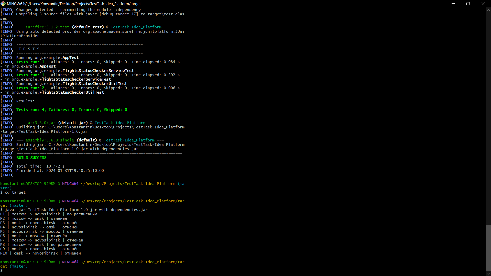

<h2>Test task for Idea Platform</h2>
<h3>Инструкция по запуску:</h3>
<ol>
<li>С помощью терминала, в папке с проектом выполнить команду: mvn clean package </li>
<li>Перейти в папку target с помощью команды: cd target </li>
<li>Запустить jar файл с помощью команды: java -jar TestTask-Idea_Platform-1.0-jar-with-dependencies.jar</li>
<li>(Опционально) Для отдельного запуска тестов, в папке с проектом можно выполнить команду: mvn clean test</li>
</ol>

<h3>Используемые технологии:</h3>
<ul>
<li>Java 17</li>
<li>Maven</li>
<li>Lombok</li>
<li>Jackson</li>
<li>JUnit5</li>
</ul>

